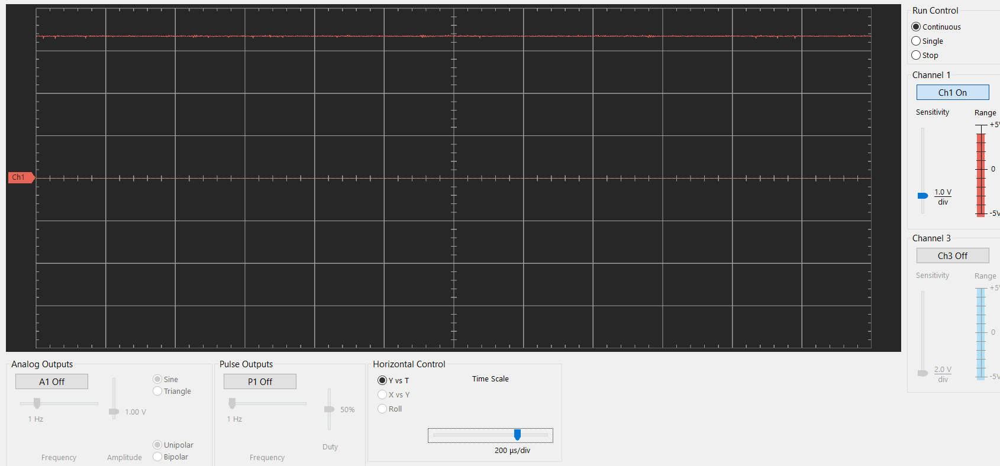
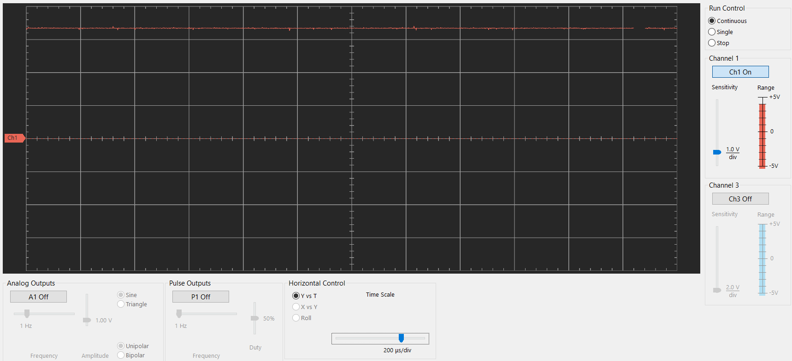
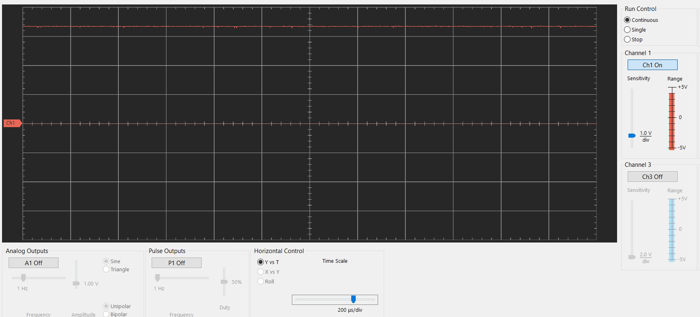
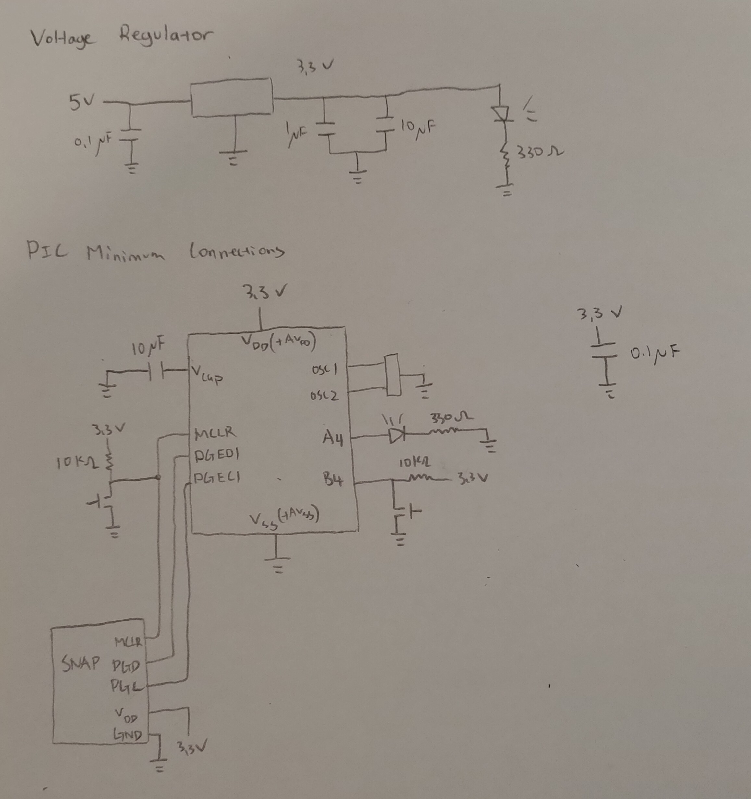
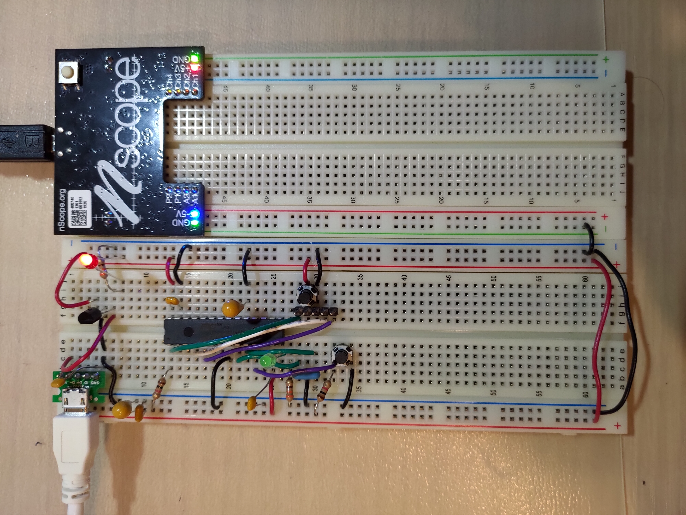
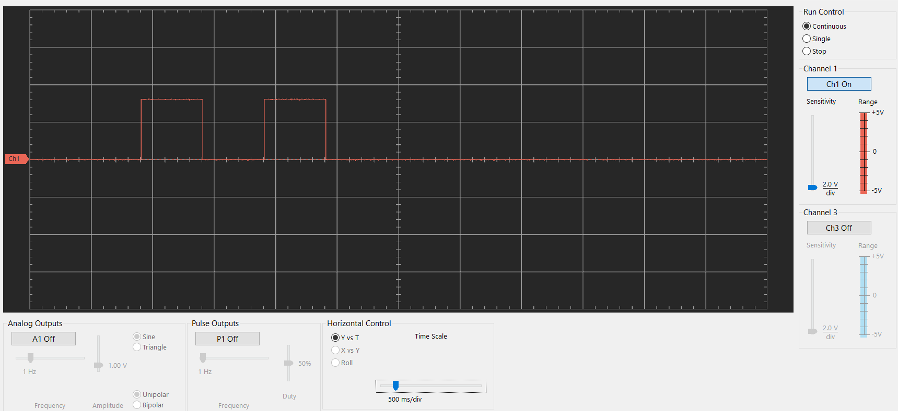

# ME433 Homework 1
Richard Yeh
### Part 1: Voltage Regulator

Output Voltage Without Bypass Capacitors:

Output Voltage With Red LED:

Output Voltage with LED and Bypass Capacitors:

### Part 2: PIC32 Minimum Connections

Circuit Diagram:

Built Circuit:

### Part 3: Blink Program

[Code](https://github.com/richardy5667/me433_AdvancedMechatronics/blob/master/HW1/HW1.X/main.c)

nScope Trace:

Video of Blinking:
https://drive.google.com/file/d/1uuFNNI16WkC6ITI_jP3DK1UKgfFdegFP/view?usp=sharing
